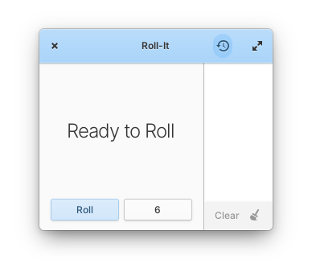
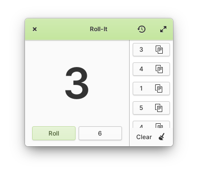

<p align="center">
  
</p>
<h1 align="center">Roll-It</h1>
<p align="center">
  <a href="https://appcenter.elementary.io/io.github.ellie_commons.rollit"></a>
</p>

|  |  |
|------------------------------------------|-----------------------------------------|

## Roll the dice

Simulate the results of rolling a die. Roll a six-sided die by default, or get the results of rolling a custom die with up to one-hundred sides.

## Installation

Roll-It is designed and developed primarily for [elementary OS]. The latest stable release is available via AppCenter.

[][AppCenter link]

Any version distributed elsewhere is not provided nor supported by me.

## Building

### Flatpak

First, install the elementary Flatpak runtime & SDK:

```shell
flatpak remote-add --if-not-exists appcenter https://flatpak.elementary.io/repo.flatpakrepo
flatpak install appcenter io.elementary.Platform//6.1 io.elementary.Sdk//6.1
```

Then, to build and install Roll-It:

```shell
flatpak-builder build io.github.ellie_commons.rollit.yml --user --install --force-clean
```

[elementary OS]: https://elementary.io
[AppCenter link]: https://appcenter.elementary.io/io.github.ellie_commons.rollit
